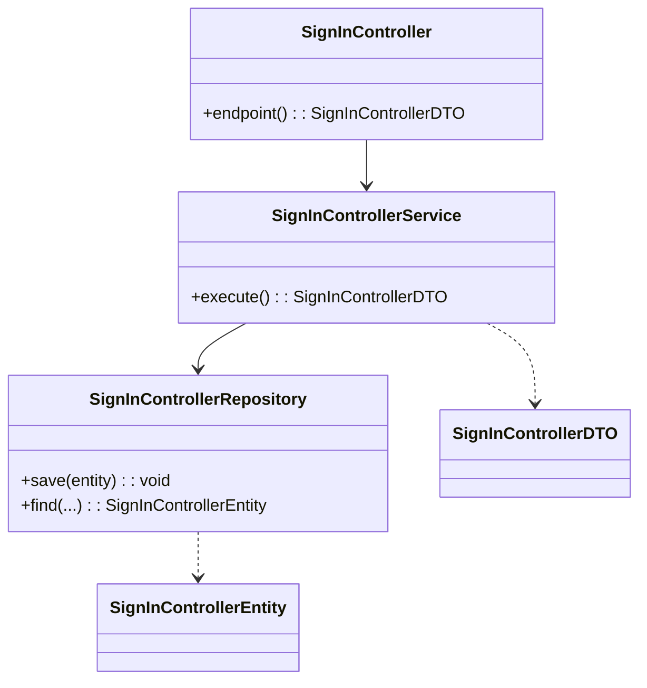
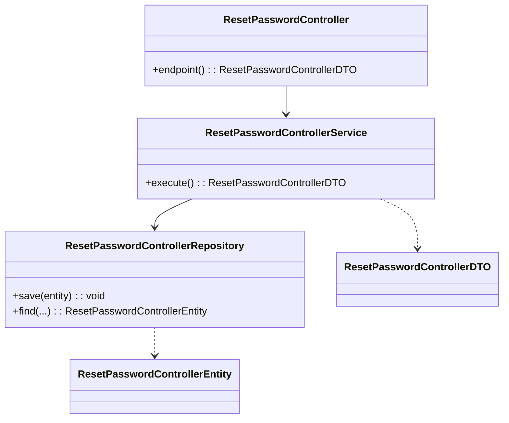
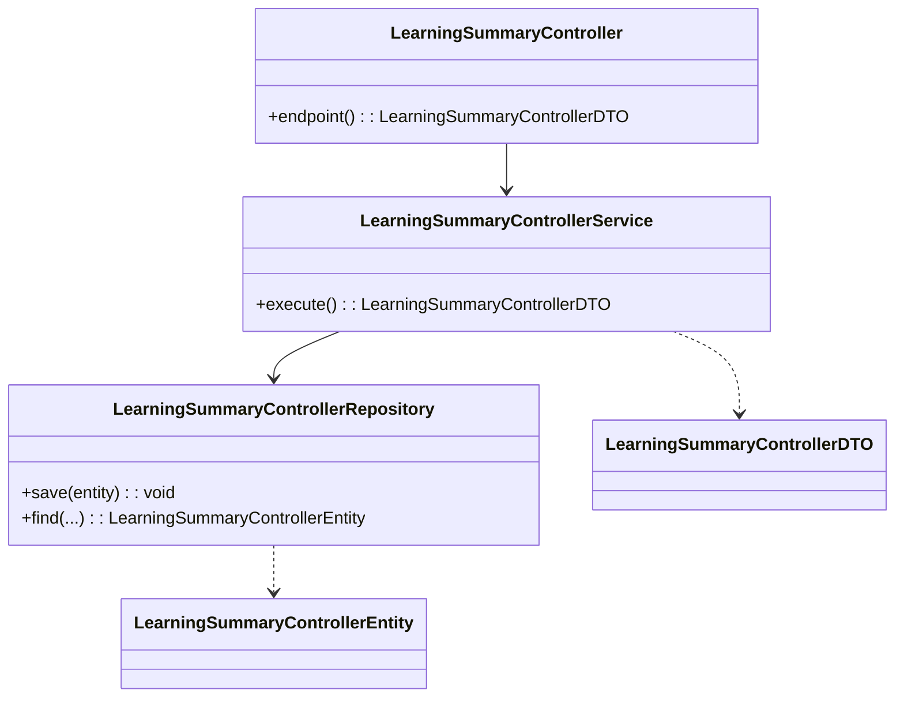
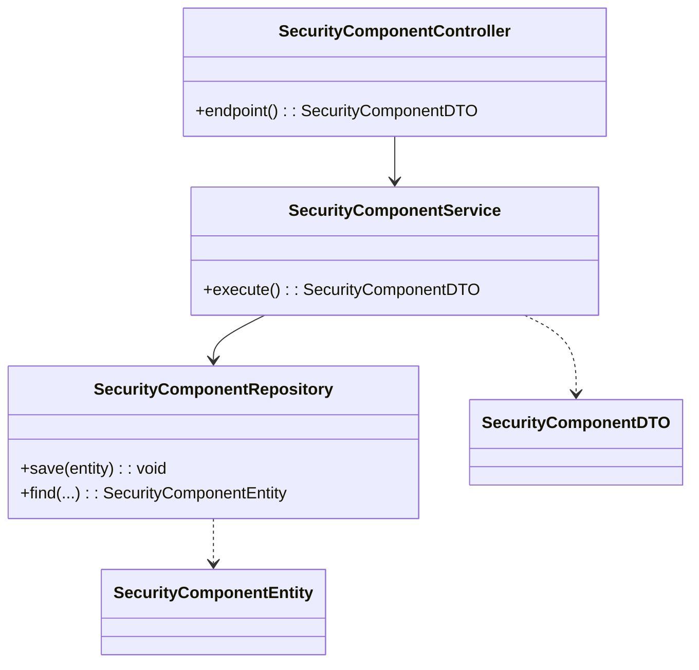
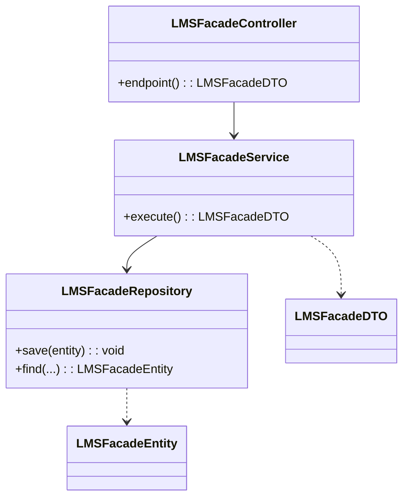
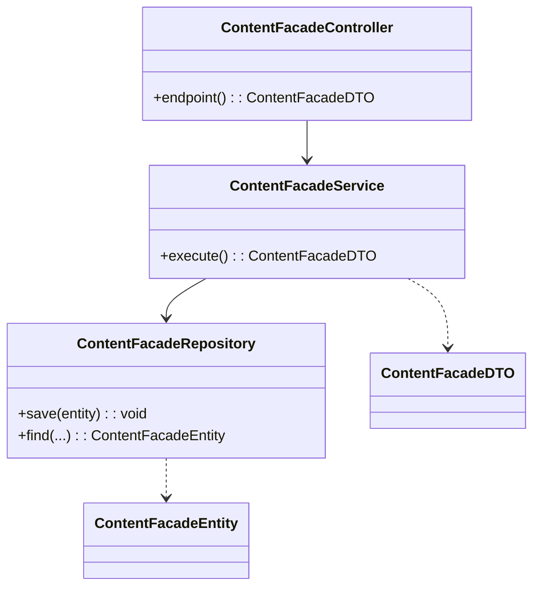
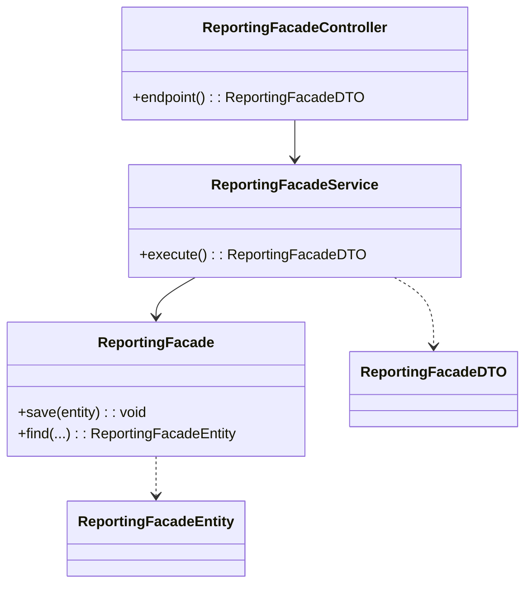
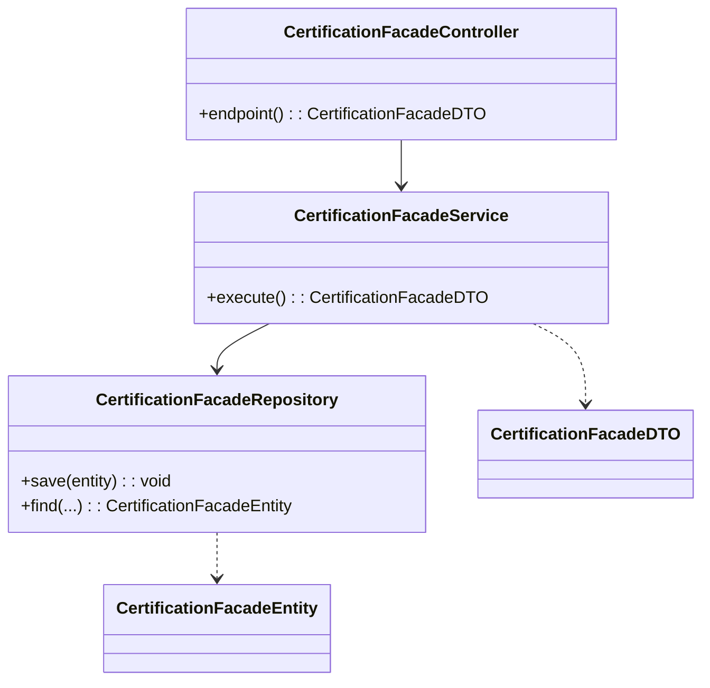
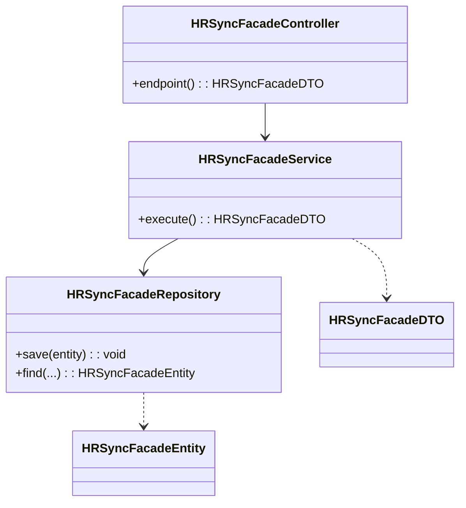

# Component Code Views (Mermaid)

## Sign In Controller

## Reset Password Controller

## Learning Summary Controller

## Security Component

## E-mail Component

## LMS Facade

## Content Facade

## Reporting Facade

## Certification Facade

## HR Sync Facade

