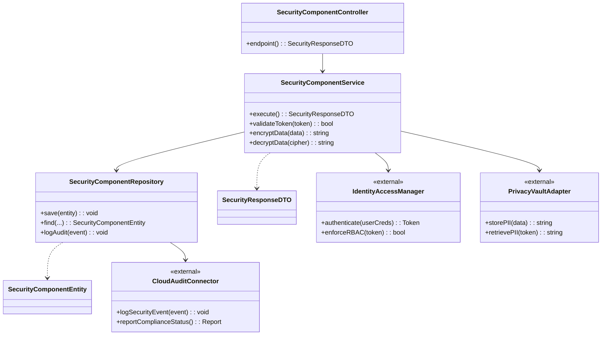

# Component Code Views (Mermaid)

## Security Component

```mermaid
classDiagram
    %% === CORE SECURITY CLASSES ===
    class SecurityComponentController {
        +endpoint(): SecurityResponseDTO
    }
    class SecurityComponentService {
        +execute(): SecurityResponseDTO
        +validateToken(token): bool
        +encryptData(data): string
        +decryptData(cipher): string
    }
    class SecurityComponentRepository {
        +save(entity): void
        +find(...): SecurityComponentEntity
        +logAudit(event): void
    }
    class SecurityComponentEntity
    class SecurityResponseDTO

    %% === CLOUD / SECURITY / PRIVACY SUPPORT LAYERS ===
    class IdentityAccessManager {
        <<external>>
        +authenticate(userCreds): Token
        +enforceRBAC(token): bool
    }
    class PrivacyVaultAdapter {
        <<external>>
        +storePII(data): string
        +retrievePII(token): string
    }
    class CloudAuditConnector {
        <<external>>
        +logSecurityEvent(event): void
        +reportComplianceStatus(): Report
    }

    %% === RELATIONSHIPS ===
    SecurityComponentController --> SecurityComponentService
    SecurityComponentService --> SecurityComponentRepository
    SecurityComponentService ..> SecurityResponseDTO
    SecurityComponentRepository ..> SecurityComponentEntity

    %% === NEW CLOUD/SECURITY/PRIVACY LINKS ===
    SecurityComponentService --> IdentityAccessManager
    SecurityComponentService --> PrivacyVaultAdapter
    SecurityComponentRepository --> CloudAuditConnector
```